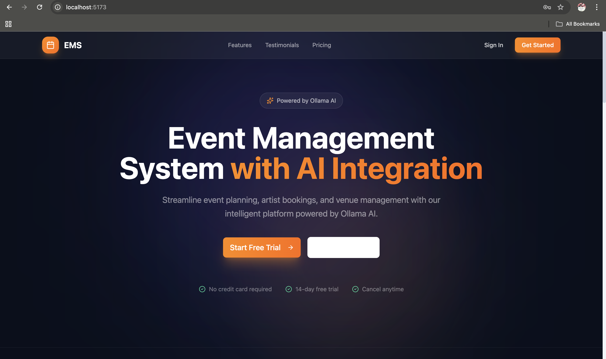
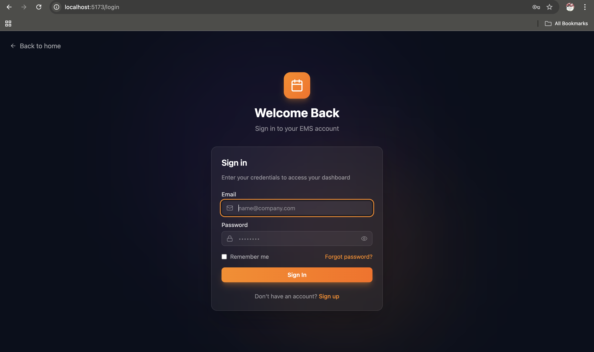
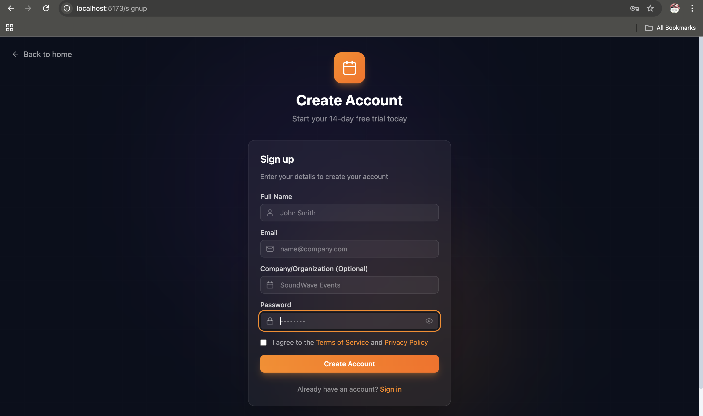
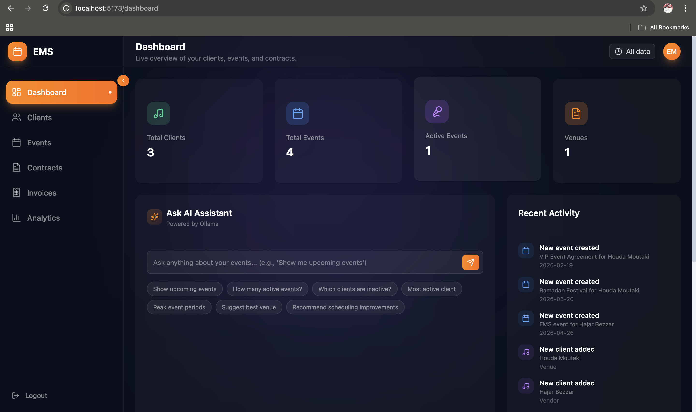
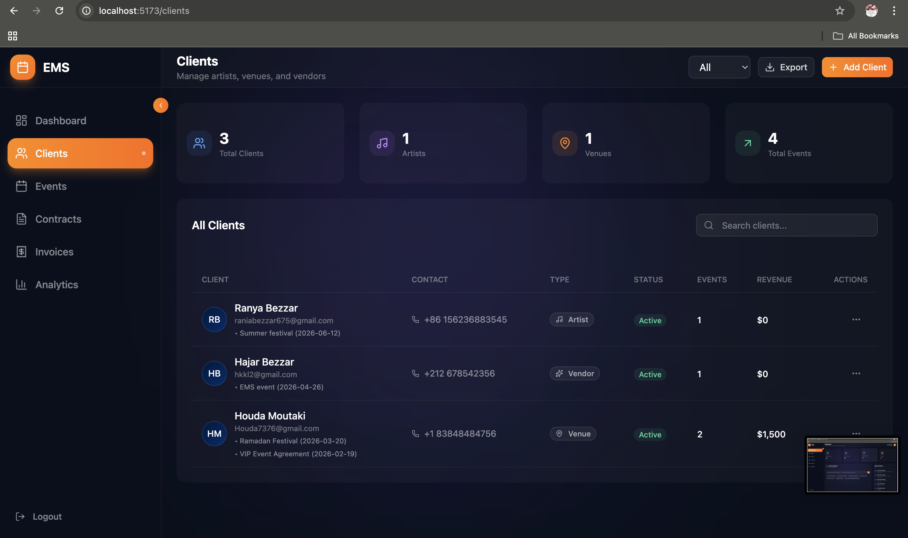
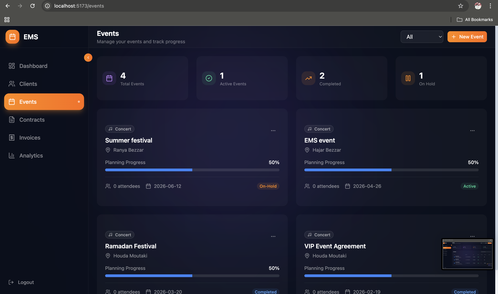
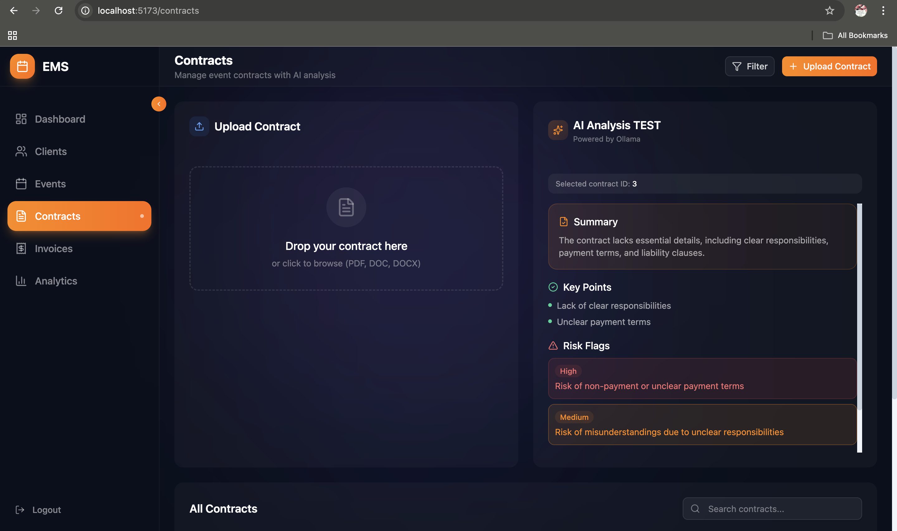
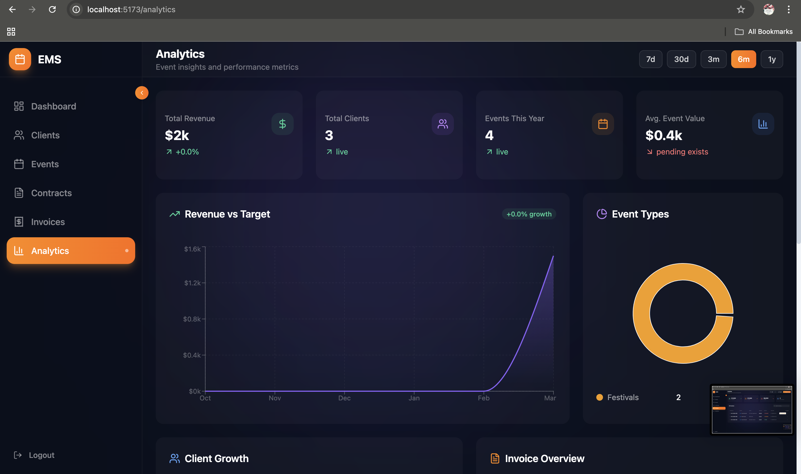
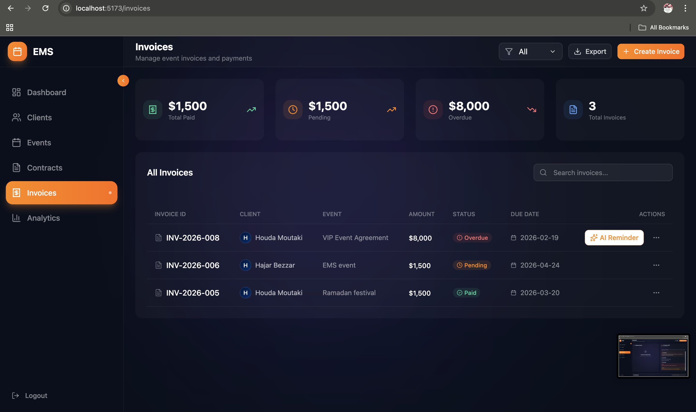

 -EMS AI CRM
AI-Powered Event & Contract Management Platform

A full-stack application that combines event management, client CRM, and AI contract analysis into one intelligent system.

 -Overview

EMS AI CRM is built to simulate a real-world business platform used by event agencies and managers.

It allows users to:

Manage events, clients, and contracts
Upload and analyze contracts automatically
Detect risks using AI
Track invoices and business status

 This is not just a CRUD app — it’s a workflow-driven system powered by AI

 System Architecture
React Frontend (UI)
        │
        │  API Requests (fetch)
        ▼
Flask Backend (REST API)
        │
        ├── SQLite Database
        ├── File Storage (Contracts)
        └── Ollama (Local AI Model)
        
 Core Features

 -Authentication

Sign up and login pages
Structured entry into the system
Foundation for secure access
 Home Page

Entry point to the application
Clean modern UI
Navigation to authentication and dashboard
 Dashboard

Overview of system activity
Displays:
Total events
Active events
Completed events
Quick insight into operations

 Client Management

Create and manage clients
Link clients to events and contracts
Centralized data for better organization

 Event Management

Create, update, and delete events
Assign clients to events
Track status:
active
completed
on-hold
Manage artists per event
Visual progress tracking

 Contract Management

Upload contracts (PDF / DOCX)
Store files and metadata
Link contracts to events and clients
Prepare contracts for AI analysis

 AI Contract Analysis (⭐ Highlight Feature)

Extract text from uploaded contracts
Analyze using local AI (Ollama)

Generate:

 Summary
 Key Points
 Risk Flags
 Recommendations

 Runs locally → no API cost + full privacy

 Invoice Management
Track invoice statuses:
pending
paid
overdue
Connect invoices to events and clients
Foundation for financial tracking

 Search & Filtering

Search across events and clients
Filter events by status
Fast UI updates

 UI / UX

Built with React + Tailwind + shadcn/ui
Dark theme + glassmorphism style
Responsive and modern design

## 📸 Screenshots

### 🏠 Home Page

### 🔐 Sign In

### 📝 Sign Up

### 📊 Dashboard

### 👥 Clients

### 📅 Events

### 📄 Contracts

### 🧠 AI Analysis

### 💰 Invoices

 Tech Stack

Frontend
React (Vite)
Tailwind CSS
shadcn/ui
Lucide Icons
Backend
Flask
Flask-SQLAlchemy
Flask-CORS
AI
Ollama (Local LLM)
Database
SQLite

 Installation

1. Clone repository
git clone https://github.com/BEZZARRANYA/ems-ai-crm.git
cd ems-ai-crm
2. Backend setup
cd backend

python3 -m venv venv
source venv/bin/activate

pip install -r requirements.txt
pip install python-docx

python app.py

Backend runs on:

http://127.0.0.1:5001
3. Frontend setup
cd app

npm install
npm run dev

Frontend runs on:

http://localhost:5173
🔗 Frontend ↔ Backend Connection

Frontend communicates with backend using REST API:

fetch("http://127.0.0.1:5001/api/events")

Flask uses CORS to allow communication between ports.

 Future Improvements
Authentication system (JWT)
Cloud deployment
Payment integration
Real-time updates
Advanced analytics dashboard
👩‍💻 Author

Ranya Bezzar
GitHub: https://github.com/BEZZARRANYA

 Final Note

This project demonstrates:

Full-stack architecture
API design and integration
AI integration in real workflows
Clean UI/UX design

⭐ Done

This version is:

Clean ✅
Professional ✅
Easy to read ✅
Portfolio-ready ✅
